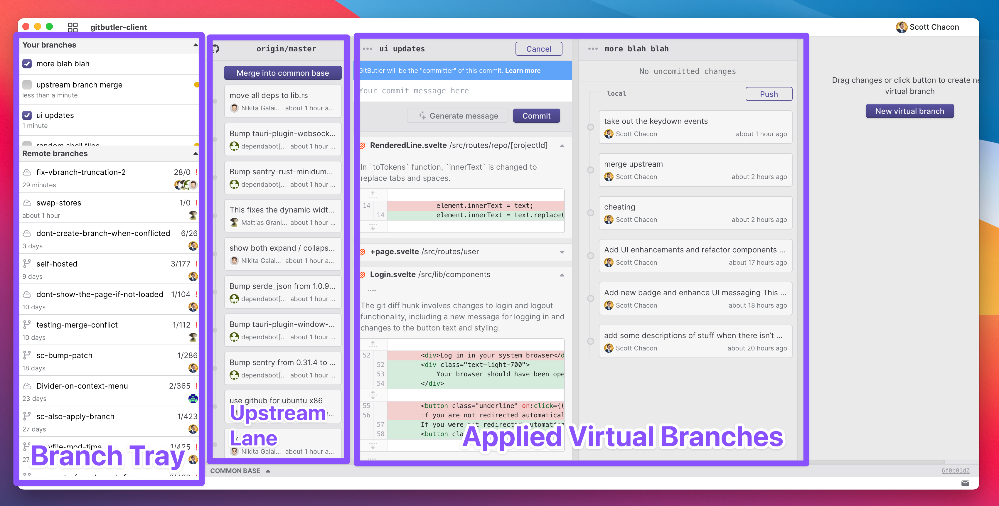

# 🔱 Branch Lanes

The main interface for Virtual Branches are a series of branch lanes. Each lane represents a scope of work that is different than what your current base branch (ie, `origin/master`) looks like. Work that is not yet in production.

This could be a local virtual branch that you're working on, or it could be a virtual branch that was created from a remote branch.

The interface looks something like this:

<figure><figcaption>
Virtual Branch lanes UI
</figcaption></figure>

There are three main sections of the branch lanes interface that you should understand.

<figure><figcaption>
The three main sections
</figcaption></figure>

## The Branch Tray

The branch tray sidebar on the left shows you the virtual branches that you have and the "remote" branches that you have available. All of these branches can be converted into virtual branches by clicking "Apply" from the menu, which you can access with a secondary click or using the context button.

### Your Branches

The top part shows "Your branches", which are the virtual branches that you have available. The checked ones are applied in your working directory and the unchecked ones are not applied. You can click the checkbox to apply them.

Next to each unapplied branch there is a status color that shows you if that branch can be cleanly applied, can be applied with merge conflicts to the base branch, or cannot be applied until you unapply other virtual branches.

### Remote Branches

Underneath that, we list the "remote" branches that you have. This is a list of Git branches that are ahead of your base branch commit (they have commits on them that your base branch does not have), and can be converted into a virtual branch.

Technically we also list local Git branches here that you may have been working on before using GitButler, so that you can convert them into virtual branches, but mostly this should be coworkers branches on your remote Git server.

## Upstream Lane

There are two states to your upstream lane. If there is no work upstream, in other words your base branch has not been pushed to since the last time you updated your work, then this will be a very small vertical lane. If there is work upstream, then we will list the upstream commits so that you are aware that your work is out of date with the upstream production branch.

You can click the "Merge into common base" button to merge the upstream work into all of your virtual branches to try to get them up to date with your production base branch.

### Applied Virtual Branches Lanes

Next you can see your list of virtual branches that are currently applied in your working directory.

<figure><figcaption></figcaption></figure>

For each virtual branch lane, there is a list of uncommitted work and committed work. If there is uncommitted work, you will see a "commit" button that expands your commit dialog. Here you can commit your uncommitted work.&#x20;

If you are logged in, you can also use our AI helper to generate your commit message automatically from the diffs of your in progress work.

You can drag the uncommitted files from one lane to another in order to separate the work. You can also drag hunks from within files if you want to split up work in one file into multiple branches.

<figure><figcaption>
Here I dragged one file over into the other lane
</figcaption></figure>

If you are logged in, our AI system will try to summarize the work in each hunk as well.

Once you have committed work, you will see it at the bottom as a list of commits under a tag that indicates that they are local. If you hit the "Push" button, it will attempt to push these commits to the same remote server that your base branch is on and will generate a branch name for you.

<figure><figcaption>
Example lane with some work in progress, one local commit and several pushed commits
</figcaption></figure>

Once you push your work, you will see the name of the remote branch that was created with the push. Any further commits will be marked as local until you push them.
